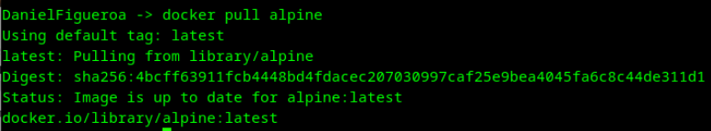
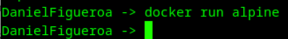
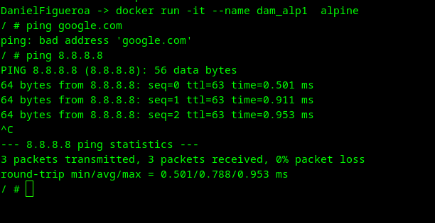
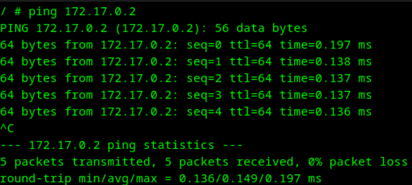
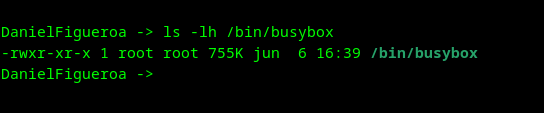

# Práctica Docker - Gestión de contenedores Alpine

## Tarea 1: Descargar imagen Alpine sin arrancarla

Con este comando descargamos la imagen de Alpine sin arrancar ningún contenedor.

La captura muestra que la imagen se ha descargado correctamente.

## Tarea 2: Arrancar un contenedor de Alpine sin nombre

Con este comando arrancamos un contenedor de Alpine sin nombre.

Para obtener el nombre del contenedor usamos el comando `docker ps -a`, ahí nos muestra los diferentes datos del contenedor, entre ellos el nombre.

## Tarea 3: Crear un contenedor Alpine con nombre dam_alp1

Con el comando `docker run -it --name dam_alp1 alpine` creamos un contenedor Alpine con el nombre dam_alp1 y accedemos a su terminal.

# Tarea 4: Acceder a internet desde el contenedor dam_alp1

Hacemos ping a google.com para comprobar que tenemos acceso a internet, y a 8.8.8.8 que es un servidor DNS de Google.
(En ese momento fallaba la conexión a internet)

Dentro de la terminal del alpine "dam_alp1" usamos el comando `ip a` para ver la IP que tiene asignada el contenedor (172.17.0.2).

## Tarea 5: Crear un contenedor Alpine con nombre dam_alp2

Creamos el contenedor dam_alp2 con el comando `docker run -it --name dam_alp2 alpine`, y usamos el comando `ip a` para ver su IP (172.17.0.3).

Al adquirir las IPs ya podemos hacer ping entre los dos contenedores.

## Tarea 6: Salir del contenedor dam_alp1 sin pararlo

Dentro de la terminal usamos la palabra `exit` para salir del contenedor sin pararlo.
Al comprobar su estado con `docker ps -a` vemos que sigue en estado está en "Exited(0)"

## Tarea 7: Comprobar cuanta memoria de disco se ocupó.

Usamos el comando en la terminal de nuestra máquina `ls -lh /bin/busybox` para ver el tamaño del archivo busybox que es el que usa Alpine.

Vemos que ocupa 755 KB en el disco

## Tarea 8: Comprobar el uso de memoria RAM de los contenedores

Usamos el comando `docker stats` para ver el uso de memoria RAM de los contenedores.

Por lo que vemos en la captura, el contenedor alp2 esta usando 746 KIB de RAM.

